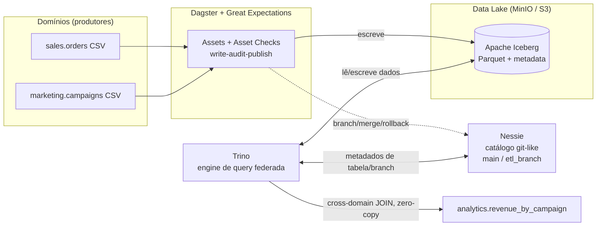

# Zero-Copy Data Mesh

Iceberg · Nessie · Trino · MinIO · Dagster

A ideia aqui é simples de explicar e chata de fazer direito: e se vários times
pudessem publicar e consultar dados uns dos outros **sem ficar copiando tabela
pra todo lado**? É isso que esse projeto monta — um data mesh onde o dado vive
uma vez só num data lake, o Trino consulta qualquer domínio na hora da query, e
o Nessie versiona o dado como se fosse git (com branch, merge e rollback de
verdade).

Tudo sobe com um `docker compose up`. Não precisa de conta em nuvem nem cartão
de crédito — roda inteiro na sua máquina.

Montei isso como projeto de portfólio, mas não parei no "compila". Subi a stack
toda, rodei os quatro cenários de ponta a ponta e, no caminho, achei (e corrigi)
três bugs que só apareceram com tudo de pé. Os resultados abaixo são reais.

## Por que isso é interessante

O ETL tradicional copia dados entre times o tempo todo: o time de analytics
puxa uma cópia da tabela de vendas, que puxa uma cópia da de marketing, e quando
você vê tem o mesmo dado em cinco lugares, cinco pipelines pra manter e ninguém
sabe qual versão é a certa. A proposta de data mesh + formato aberto (Iceberg) é
cortar isso na raiz.

Quatro coisas que eu queria mostrar funcionando:

- **Consulta entre domínios sem cópia.** A tabela `analytics.revenue_by_campaign`
  cruza `sales` com `marketing` num JOIN — dois domínios, uma query, zero dado
  duplicado. O Trino lê os arquivos onde eles já estão.
- **Dado como código.** O pipeline escreve num *branch* do Nessie, valida ali, e
  só faz merge na `main` se passar. Se o dado vier ruim, é só descartar o branch.
  Mesma vibe de um PR que você não dá merge.
- **Otimização que vira economia.** Particionamento escondido por dia, compaction
  e ordenação reduzem quantos arquivos o Trino precisa abrir num scan — que na
  nuvem é dinheiro direto.
- **Qualidade na hora de escrever.** Great Expectations roda como check bloqueante
  no Dagster. Dado que não passa simplesmente não chega na `main`.

## Como as peças se encaixam



O truque do "zero-copy" está em quem faz o quê. Quem escreve e lê os arquivos no
S3 é o Trino; o Nessie só guarda ponteiros pra esses arquivos. Quando você cria
um branch, ele não duplica nada — aponta pros mesmos arquivos da `main` e só
escreve coisa nova no que de fato mudou (copy-on-write). E os domínios nunca
trocam cópias entre si: o JOIN só existe no instante da consulta.

| Peça | O que faz |
|---|---|
| **MinIO** | armazenamento S3-compatible — o data lake propriamente dito |
| **Apache Iceberg** | formato de tabela com snapshots, particionamento escondido e time-travel |
| **Project Nessie** | catálogo com versionamento estilo git (branch, merge, rollback) |
| **Trino** | engine de query distribuída que enxerga todos os domínios |
| **Dagster** | orquestração, com lineage e checks de qualidade nos assets |
| **Great Expectations** | as regras de qualidade que rodam antes de publicar |

## Rodando na sua máquina

Só precisa de Docker com Compose.

```bash
# 1. Sobe tudo (na primeira vez ele builda a imagem do Dagster)
docker compose up -d --build

# 2. Confere se ficou tudo de pé (leva ~1-2 min)
docker compose ps

# 3. Popula a main: materializa os assets (sales, marketing, analytics)
docker compose exec dagster dagster asset materialize --select '*' -m data_mesh

# 4. Roda a demo de "dado como código" (branch -> valida -> merge ou rollback)
docker compose exec dagster python -m data_mesh.demo

# 5. Abre o Trino e consulta os domínios cruzados
docker compose exec -it trino trino
#   trino> SELECT * FROM iceberg.analytics.revenue_by_campaign ORDER BY revenue DESC;
```

As interfaces web ficam aqui:

| Serviço | URL |
|---|---|
| Dagster | http://localhost:3000 |
| Trino | http://localhost:8085 |
| MinIO | http://localhost:9001 (usuário e senha: `minioadmin`) |
| Nessie | http://localhost:19120/api/v2/trees |

Se você estiver no Windows sem `make`, é só usar os comandos `docker compose`
acima. Com `make` instalado, dá pra encurtar: `make up`, `make seed`, `make demo`,
`make query`.

## Os quatro cenários, na prática

**1. Cruzando domínios sem cópia.**
[`sql/10_cross_domain_query.sql`](sql/10_cross_domain_query.sql) junta
`sales.orders` com `marketing.campaigns` e devolve receita e ROI por campanha. O
asset `analytics.revenue_by_campaign` é exatamente esse JOIN materializado como
camada gold. Nenhum byte foi copiado de um domínio pro outro.

**2. Dado como código (write-audit-publish).**
Rodando [`python -m data_mesh.demo`](orchestration/data_mesh/demo.py) você vê o
fluxo inteiro. Primeiro um lote propositalmente ruim (amount negativo e
`campaign_id` nulo): ele é escrito num branch isolado, o Great Expectations
reprova, e o branch é descartado — a `main` nem fica sabendo. Depois um lote bom:
passa na validação e é mergeado de forma atômica na `main`. Foi essa a saída
real da última execução:

```
main.orders ANTES = 400

=== Lote 'RUIM': WRITE -> AUDIT -> PUBLISH/ROLLBACK ===
  [write] orders no branch=402 | em main=400 (isolado)
  [audit] Great Expectations success=False
          FALHOU: expect_column_values_to_not_be_null (col=campaign_id)
          FALHOU: expect_column_values_to_be_between (col=amount)
  [rollback] DROP BRANCH etl_branch. main intacto. Nada publicado.

=== Lote 'BOM': WRITE -> AUDIT -> PUBLISH/ROLLBACK ===
  [audit] Great Expectations success=True
  [publish] MERGE etl_branch -> main (atômico). Branch removido.

main.orders DEPOIS = 403  (delta = 3)
```

O mesmo fluxo também existe como job no Dagster (`data_as_code_job`), se você
preferir disparar pela interface.

**3. Particionamento escondido e compaction.**
[`sql/20_partitioning_and_optimize.sql`](sql/20_partitioning_and_optimize.sql)
mostra o `EXPLAIN` cortando partições por `order_ts` sem você ter criado nenhuma
coluna de partição na mão — o Iceberg cuida disso. Em seguida `optimize` e
`sorted_by` reorganizam os arquivos pra reduzir o I/O dos scans.

**4. Qualidade antes de publicar.**
Os assets de `sales` e `marketing` carregam asset checks bloqueantes com Great
Expectations. Se a suíte falha, o dado não vai pra `main` e o asset de analytics
nem chega a rodar — dá pra ver isso direitinho no grafo do Dagster.

## O que isso não é (sendo honesto)

Nenhum projeto de portfólio é produção, e tem decisões aqui que eu tomei pra
caber numa máquina e numa tarde:

- O Nessie está em modo `IN_MEMORY`, então os branches somem quando você dá
  `docker compose down`. Pra persistir é trocar por `ROCKSDB` com volume — deixei
  comentado no [docker-compose.yml](docker-compose.yml).
- Tratei cada domínio como um schema (`sales`, `marketing`) no mesmo catálogo. É
  um padrão válido de mesh sobre um lake; pra isolamento de governança mais sério,
  daria pra ter um catálogo Trino por domínio.
- A ingestão é via `INSERT` porque os volumes são pequenos e didáticos. Em escala
  real isso seria Spark ou PyIceberg.
- Sobre Z-Order: o Trino faz compaction com `sorted_by` (ordenação linear). O
  Z-Order de verdade do Iceberg (curva de Morton/Hilbert) vem via Spark
  `rewrite_data_files(strategy => 'sort', sort_order => 'zorder(...)')`. Deixei o
  snippet em [sql/20](sql/20_partitioning_and_optimize.sql) — o efeito de negócio
  (ler menos arquivo em filtro multi-coluna) é o mesmo.

## Para onde isso poderia ir

Se eu fosse continuar, os próximos passos óbvios seriam: persistir o Nessie e
ligar autenticação; separar catálogos por domínio; trocar a ingestão por
Spark/PyIceberg com CDC; formalizar contratos de dados (ODCS) com alertas; e um
CI que sobe a stack e roda esses quatro cenários como teste de integração.

## Estrutura do repositório

```
zero-copy-lakehouse/
├── docker-compose.yml            # MinIO + Nessie + Trino + Dagster
├── infra/trino/catalog/
│   ├── iceberg.properties        # catálogo -> branch main
│   └── iceberg_dev.properties    # catálogo -> branch etl_branch
├── data/                         # dados seed dos domínios (CSV)
│   ├── sales/orders.csv
│   └── marketing/campaigns.csv
├── orchestration/                # projeto Dagster
│   └── data_mesh/
│       ├── assets/               # sales, marketing, analytics (cross-domain)
│       ├── quality/expectations.py
│       ├── nessie.py             # cliente REST v2 (branch/merge/delete)
│       ├── trino_io.py           # acesso ao Trino
│       ├── demo.py               # demo data-as-code
│       └── definitions.py        # Definitions do Dagster
├── sql/                          # queries de exploração (Trino CLI)
└── scripts/generate_seed_data.py # gera os CSVs (determinístico)
```
