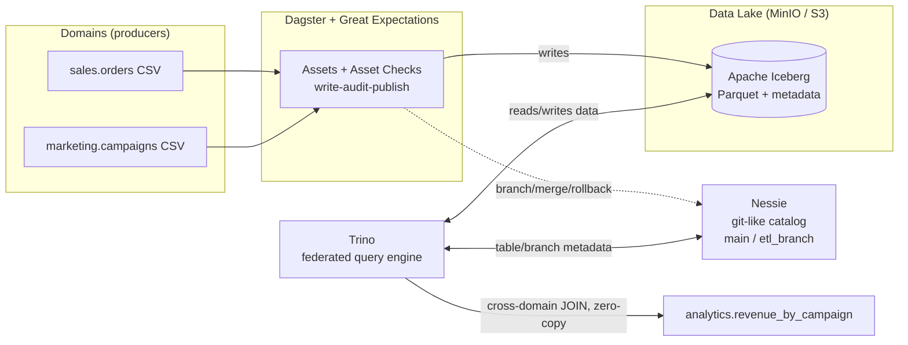

**English** · [Português](README.pt-BR.md)

# Zero-Copy Data Mesh

Iceberg · Nessie · Trino · MinIO · Dagster

The idea is easy to pitch and annoying to get right: what if several teams could
publish and query each other's data **without copying tables all over the place**?
That's what this project builds — a data mesh where data lives in a single data
lake, Trino queries any domain at query time, and Nessie versions the data like
git (with real branch, merge and rollback).

The whole thing comes up with one `docker compose up`. No cloud account, no credit
card — it runs entirely on your machine.

I built this as a portfolio project, but I didn't stop at "it compiles." I brought
the whole stack up, ran the four scenarios end to end and, along the way, found
(and fixed) three bugs that only showed up with everything running. The results
below are real.

## Why this is interesting

Traditional ETL copies data between teams constantly: the analytics team pulls a
copy of the sales table, which pulls a copy of marketing's, and before you know it
the same data lives in five places, with five pipelines to maintain and nobody
sure which version is the source of truth. Data mesh on an open format (Iceberg)
is about cutting that at the root.

Four things I wanted to see actually working:

- **Cross-domain queries with no copy.** The `analytics.revenue_by_campaign` table
  joins `sales` with `marketing` — two domains, one query, zero duplicated data.
  Trino reads the files where they already live.
- **Data as code.** The pipeline writes to a Nessie *branch*, validates there, and
  only merges into `main` if it passes. If the data comes in bad, you just throw
  the branch away. Same vibe as a PR you decide not to merge.
- **Optimization that turns into savings.** Hidden partitioning by day, compaction
  and sorting reduce how many files Trino has to open in a scan — which in the
  cloud is money straight up.
- **Quality at write time.** Great Expectations runs as a blocking check in
  Dagster. Data that doesn't pass simply never reaches `main`.

## How the pieces fit together



The "zero-copy" trick is about who does what. Trino is the one writing and reading
the files on S3; Nessie only keeps pointers to those files. When you create a
branch, it doesn't duplicate anything — it points at the same files as `main` and
only writes new data where something actually changed (copy-on-write). And the
domains never swap copies with each other: the JOIN only exists at the moment of
the query.

| Piece | What it does |
|---|---|
| **MinIO** | S3-compatible object storage — the data lake itself |
| **Apache Iceberg** | table format with snapshots, hidden partitioning and time-travel |
| **Project Nessie** | catalog with git-style versioning (branch, merge, rollback) |
| **Trino** | distributed query engine that sees every domain |
| **Dagster** | orchestration, with lineage and quality checks on the assets |
| **Great Expectations** | the quality rules that run before publishing |

## Running it locally

All you need is Docker with Compose.

```bash
# 1. Bring everything up (first run builds the Dagster image)
docker compose up -d --build

# 2. Check it's all healthy (takes ~1-2 min)
docker compose ps

# 3. Populate main: materialize the assets (sales, marketing, analytics)
docker compose exec dagster dagster asset materialize --select '*' -m data_mesh

# 4. Run the "data as code" demo (branch -> validate -> merge or rollback)
docker compose exec dagster python -m data_mesh.demo

# 5. Open Trino and query the domains together
docker compose exec -it trino trino
#   trino> SELECT * FROM iceberg.analytics.revenue_by_campaign ORDER BY revenue DESC;
```

The web UIs live here:

| Service | URL |
|---|---|
| Dagster | http://localhost:3000 |
| Trino | http://localhost:8085 |
| MinIO | http://localhost:9001 (user and password: `minioadmin`) |
| Nessie | http://localhost:19120/api/v2/trees |

On Windows without `make`, just use the `docker compose` commands above. With
`make` installed you can shorten things: `make up`, `make seed`, `make demo`,
`make query`.

## The four scenarios, in practice

**1. Crossing domains with no copy.**
[`sql/10_cross_domain_query.sql`](sql/10_cross_domain_query.sql) joins
`sales.orders` with `marketing.campaigns` and returns revenue and ROI per campaign.
The `analytics.revenue_by_campaign` asset is exactly that JOIN materialized as a
gold layer. Not a single byte was copied from one domain to the other.

**2. Data as code (write-audit-publish).**
Running [`python -m data_mesh.demo`](orchestration/data_mesh/demo.py) shows the
whole flow. First a deliberately bad batch (negative amount and null
`campaign_id`): it's written to an isolated branch, Great Expectations rejects it,
and the branch is discarded — `main` never even hears about it. Then a good batch:
it passes validation and gets merged atomically into `main`. This was the actual
output from the last run (the log labels are in Portuguese — `RUIM` = bad,
`BOM` = good):

```
main.orders ANTES = 400

=== Lote 'RUIM': WRITE -> AUDIT -> PUBLISH/ROLLBACK ===
  [write] orders no branch=402 | em main=400 (isolado)
  [audit] Great Expectations success=False
          FALHOU: expect_column_values_to_not_be_null (col=campaign_id)
          FALHOU: expect_column_values_to_be_between (col=amount)
  [rollback] DROP BRANCH etl_branch. main intacto. Nada publicado.

=== Lote 'BOM': WRITE -> AUDIT -> PUBLISH/ROLLBACK ===
  [audit] Great Expectations success=True
  [publish] MERGE etl_branch -> main (atômico). Branch removido.

main.orders DEPOIS = 403  (delta = 3)
```

The same flow also exists as a Dagster job (`data_as_code_job`) if you'd rather
trigger it from the UI.

**3. Hidden partitioning and compaction.**
[`sql/20_partitioning_and_optimize.sql`](sql/20_partitioning_and_optimize.sql)
shows the `EXPLAIN` pruning partitions by `order_ts` without you ever creating a
partition column by hand — Iceberg handles it. Then `optimize` and `sorted_by`
reorganize the files to cut down the I/O of scans.

**4. Quality before publishing.**
The `sales` and `marketing` assets carry blocking asset checks with Great
Expectations. If the suite fails, the data doesn't go to `main` and the analytics
asset doesn't even run — you can see this clearly in the Dagster graph.

## What this is not (being honest)

No portfolio project is production, and there are decisions here I made to fit a
single machine and an afternoon:

- Nessie runs in `IN_MEMORY` mode, so branches disappear when you run
  `docker compose down`. To persist, switch it to `ROCKSDB` with a volume — I left
  it commented in the [docker-compose.yml](docker-compose.yml).
- I treated each domain as a schema (`sales`, `marketing`) in the same catalog.
  It's a valid mesh-on-a-lake pattern; for stricter governance isolation you could
  have one Trino catalog per domain.
- Ingestion is via `INSERT` because the volumes are small and didactic. At real
  scale this would be Spark or PyIceberg.
- On Z-Order: Trino does compaction with `sorted_by` (linear ordering). True
  Iceberg Z-Order (Morton/Hilbert curve) comes via Spark
  `rewrite_data_files(strategy => 'sort', sort_order => 'zorder(...)')`. I left the
  snippet in [sql/20](sql/20_partitioning_and_optimize.sql) — the business effect
  (reading fewer files on multi-column filters) is the same.

## Where this could go

If I were to keep going, the obvious next steps would be: persist Nessie and turn
on authentication; split catalogs per domain; swap ingestion for Spark/PyIceberg
with CDC; formalize data contracts (ODCS) with alerts; and a CI that brings the
stack up and runs these four scenarios as an integration test.

## Repository layout

```
zero-copy-lakehouse/
├── docker-compose.yml            # MinIO + Nessie + Trino + Dagster
├── infra/trino/catalog/
│   ├── iceberg.properties        # catalog -> main branch
│   └── iceberg_dev.properties    # catalog -> etl_branch branch
├── data/                         # domain seed data (CSV)
│   ├── sales/orders.csv
│   └── marketing/campaigns.csv
├── orchestration/                # Dagster project
│   └── data_mesh/
│       ├── assets/               # sales, marketing, analytics (cross-domain)
│       ├── quality/expectations.py
│       ├── nessie.py             # REST v2 client (branch/merge/delete)
│       ├── trino_io.py           # Trino access
│       ├── demo.py               # data-as-code demo
│       └── definitions.py        # Dagster Definitions
├── sql/                          # exploration queries (Trino CLI)
└── scripts/generate_seed_data.py # generates the CSVs (deterministic)
```
