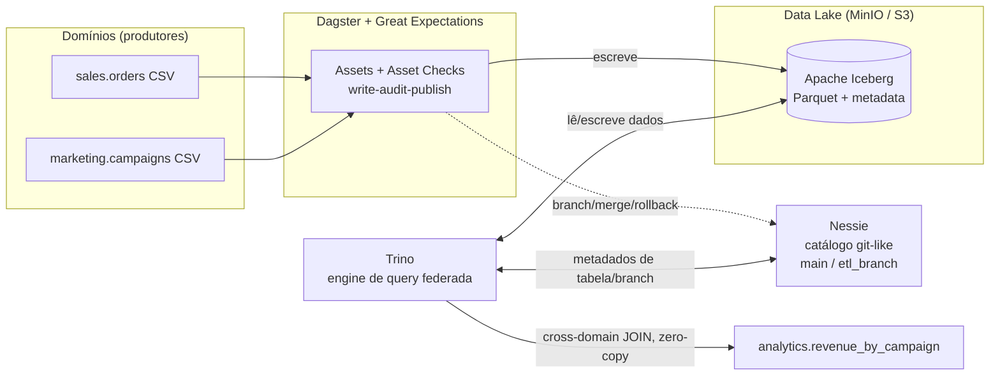

# Zero-Copy Data Mesh — Iceberg · Nessie · Trino · MinIO · Dagster

Plataforma de dados **descentralizada (data mesh)** que elimina os pipelines
tradicionais de cópia (ETL) entre domínios. Cada domínio publica suas tabelas
como **Apache Iceberg** num data lake S3 (MinIO); o **Trino** consulta tudo de
forma federada **sem duplicar dados**; o **Nessie** dá semântica **git ao dado**
(branch, merge, rollback); e o **Dagster + Great Expectations** garantem
**qualidade no momento da escrita** (write-audit-publish).

> Roda 100% local via Docker Compose. **Custo de nuvem: zero.**

---

## O que este projeto demonstra

| Diferencial | Como é demonstrado |
|---|---|
| 🔗 **Zero-copy / cross-domain** | `analytics.revenue_by_campaign` faz JOIN entre os domínios `sales` e `marketing` sem mover nem copiar dados ([sql/10](sql/10_cross_domain_query.sql)). |
| 🌿 **Data-as-Code** | Pipeline escreve num **branch** do Nessie, valida e só então faz **merge** em `main` — ou **rollback** se a qualidade falhar ([demo.py](orchestration/data_mesh/demo.py)). |
| 💰 **Custo/performance** | **Hidden partitioning** por `day(order_ts)`, **compaction** (`optimize`) e **sort/clustering** reduzem arquivos lidos no scan ([sql/20](sql/20_partitioning_and_optimize.sql)). |
| ✅ **Qualidade no write** | **Great Expectations** roda como *asset check* bloqueante no Dagster; dado ruim não chega em `main` ([expectations.py](orchestration/data_mesh/quality/expectations.py)). |

---

## Arquitetura



**Por que zero-copy?** O Trino é o cliente Iceberg que lê/escreve direto no S3.
O Nessie só guarda **ponteiros de metadados**. Um branch **não duplica arquivos** —
ele compartilha os mesmos arquivos de `main` e só cria novos no que muda
(copy-on-write). Os domínios também não copiam dados entre si: o JOIN acontece
no momento da query.

---

## Stack

| Camada | Tecnologia | Papel |
|---|---|---|
| Storage | **MinIO** | object storage S3-compatible (o data lake) |
| Table format | **Apache Iceberg** | tabelas com snapshots, hidden partitioning, time-travel |
| Catálogo | **Project Nessie** | versionamento git-like (branch/merge/rollback) |
| Query/Compute | **Trino** | engine SQL federada e distribuída |
| Orquestração | **Dagster** | assets, asset checks, lineage |
| Qualidade | **Great Expectations** | validação no write |

---

## Estrutura

```
zero-copy-lakehouse/
├── docker-compose.yml            # MinIO + Nessie + Trino + Dagster
├── infra/trino/catalog/
│   ├── iceberg.properties        # catálogo -> branch main
│   └── iceberg_dev.properties    # catálogo -> branch etl_branch
├── data/                         # dados seed dos domínios (CSV)
│   ├── sales/orders.csv
│   └── marketing/campaigns.csv
├── orchestration/                # projeto Dagster
│   ├── Dockerfile · requirements.txt · pyproject.toml
│   └── data_mesh/
│       ├── assets/               # sales, marketing, analytics (cross-domain)
│       ├── quality/expectations.py   # Great Expectations
│       ├── nessie.py             # cliente REST v2 (branch/merge/delete)
│       ├── trino_io.py           # acesso ao Trino
│       ├── demo.py               # demo data-as-code (WAP)
│       └── definitions.py        # Definitions do Dagster
├── sql/                          # queries de exploração (Trino CLI)
└── scripts/generate_seed_data.py # gera os CSVs (determinístico)
```

---

## Quickstart

**Pré-requisitos:** Docker + Docker Compose.

```bash
# 1. Subir a stack (build do Dagster na primeira vez)
docker compose up -d --build

# 2. Esperar tudo ficar saudável (~1-2 min). Checar:
docker compose ps

# 3. Popular main: materializar os assets (sales, marketing, analytics)
docker compose exec dagster dagster asset materialize --select '*' -m data_mesh

# 4. Rodar a demo data-as-code (branch -> validar -> merge/rollback)
docker compose exec dagster python -m data_mesh.demo

# 5. Consultar via Trino (cross-domain JOIN)
docker compose exec -it trino trino
#   trino> SELECT * FROM iceberg.analytics.revenue_by_campaign ORDER BY revenue DESC;
```

UIs disponíveis:

| Serviço | URL |
|---|---|
| Dagster | http://localhost:3000 |
| Trino   | http://localhost:8080 |
| MinIO console | http://localhost:9001 (`minioadmin` / `minioadmin`) |
| Nessie API | http://localhost:19120/api/v2/trees |

> No Windows sem `make`, use os comandos `docker compose ...` acima.
> Com `make`: `make up`, `make seed`, `make demo`, `make query`.

---

## As 4 demonstrações

### 1) Zero-copy cross-domain
[`sql/10_cross_domain_query.sql`](sql/10_cross_domain_query.sql) — JOIN entre
`sales.orders` e `marketing.campaigns`. Dois domínios, uma query, nenhuma cópia.
O asset `analytics.revenue_by_campaign` materializa isso como tabela gold.

### 2) Data-as-Code (Write-Audit-Publish)
[`python -m data_mesh.demo`](orchestration/data_mesh/demo.py) executa:

1. **Lote RUIM** (amount negativo + `campaign_id` nulo) → escrito no branch
   `etl_branch` → **Great Expectations FALHA** → `DROP BRANCH` (**rollback**).
   `main` nunca enxerga o dado ruim.
2. **Lote BOM** → escrito no branch → **GE PASSA** → `MERGE etl_branch → main`
   (**publish atômico**).

Saída esperada (resumida):

```
main.orders ANTES = 400
=== Lote 'RUIM': WRITE -> AUDIT -> PUBLISH/ROLLBACK ===
  [audit] Great Expectations success=False
          FALHOU: ExpectColumnValuesToBeBetween (col=amount) ...
  [rollback] DROP BRANCH etl_branch. main intacto.
=== Lote 'BOM': WRITE -> AUDIT -> PUBLISH/ROLLBACK ===
  [audit] Great Expectations success=True
  [publish] MERGE etl_branch -> main (atômico).
main.orders DEPOIS = 403  (delta = 3)
```

Também disponível como **job no Dagster** (`data_as_code_job`).

### 3) Hidden partitioning + otimização de custo
[`sql/20_partitioning_and_optimize.sql`](sql/20_partitioning_and_optimize.sql) —
`EXPLAIN` mostra **partition pruning** por `order_ts` (sem coluna de partição
explícita); `optimize` + `sorted_by` reduzem o número de arquivos lidos.

### 4) Qualidade no write
Os assets `sales.orders` e `marketing.campaigns` têm **asset checks bloqueantes**
com Great Expectations. Se a suite falhar, o dado **não** é escrito em `main` e o
asset downstream (`analytics`) **não** roda. Visível na UI do Dagster.

---

## Notas honestas / limitações

- **Nessie em modo `IN_MEMORY`**: branches/commits reiniciam ao `docker compose down`.
  Para persistir, troque para `ROCKSDB` + volume no [docker-compose.yml](docker-compose.yml).
- **Domínios = schemas** (`sales`, `marketing`) sobre o mesmo catálogo. É o padrão
  de mesh sobre um lake; para isolamento total, daria para usar catálogos Trino
  separados por domínio.
- **Ingestão via `INSERT`** (volumes pequenos, didáticos). Em produção entraria
  Spark/PyIceberg para cargas grandes.
- **Z-Order**: o Trino faz compaction + `sorted_by` (ordenação linear). O Z-Order
  verdadeiro do Iceberg é via Spark `rewrite_data_files(strategy=>'sort',
  sort_order=>'zorder(...)')` — snippet incluído em [sql/20](sql/20_partitioning_and_optimize.sql).

## Possíveis próximos passos

- Persistência do Nessie (RocksDB/Postgres) + autenticação.
- Catálogos Trino por domínio (isolamento de governança).
- Carga em escala com Spark/PyIceberg + CDC.
- Data contracts (ODCS) + alertas de qualidade.
- CI que sobe a stack e roda os 4 cenários como testes de integração.

---

## Como funciona, em uma frase

> O dado vive **uma vez** no lake; **Trino** consulta qualquer domínio sem cópia,
> **Nessie** versiona como git, e **Dagster + Great Expectations** garantem que só
> dado bom é publicado em `main`.
